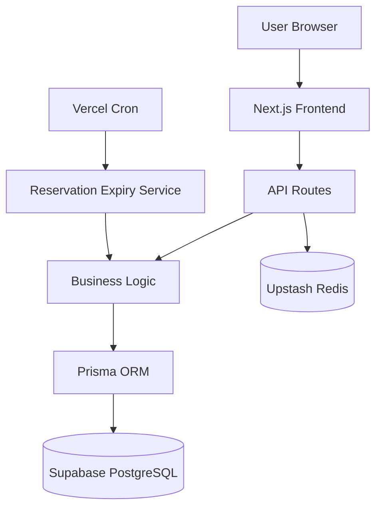
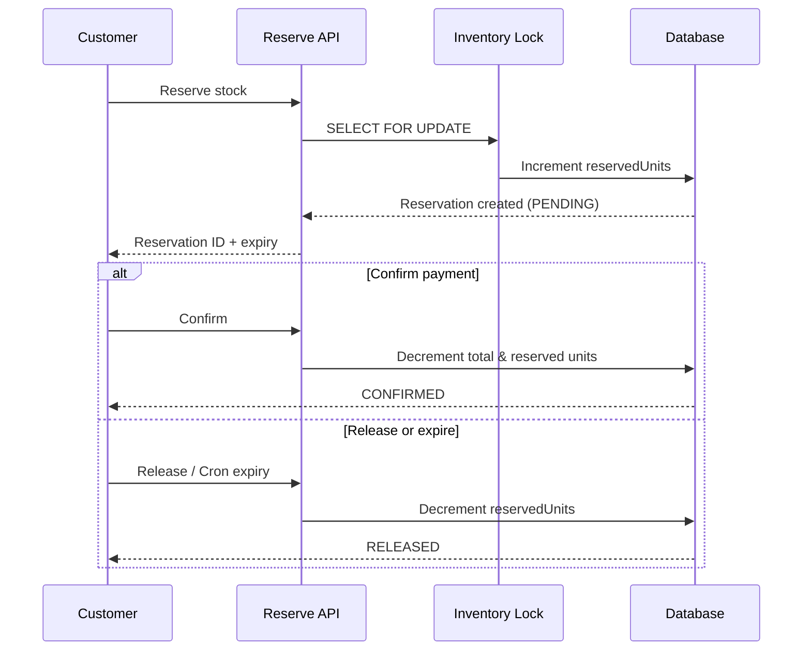

# Allo Inventory Reservation System

## Overview

This system prevents overselling in multi-warehouse inventory by introducing **temporary reservations** during checkout. When a customer reserves stock, units are held for a limited time before payment is completed.

**Happy path:** Reserve inventory → Confirm payment → Stock is permanently decremented.

**Alternate path:** Reserve inventory → Expire or cancel → Reserved stock is released back to available inventory.

Concurrency-safe locking and idempotent APIs ensure reliable behavior under parallel requests.

---

## Features

- ✓ Multi-warehouse inventory tracking
- ✓ Reservation creation
- ✓ Reservation confirmation
- ✓ Reservation release
- ✓ Reservation expiry
- ✓ Concurrency-safe stock handling
- ✓ Idempotent APIs
- ✓ Responsive UI

---

## Tech Stack

| Layer | Technologies |
|-------|----------------|
| **Frontend** | Next.js, TypeScript, Tailwind CSS |
| **Backend** | Next.js API Routes, Prisma |
| **Database** | Supabase PostgreSQL |
| **Caching** | Upstash Redis |
| **Deployment** | Vercel |

---

## Architecture



---

## Reservation Flow



---

## Setup

```bash
git clone <repository-url>
cd inventory-reservation-system
npm install
```

Create a `.env` file:

```env
DATABASE_URL="postgresql://..."
DIRECT_URL="postgresql://..."
UPSTASH_REDIS_REST_URL="https://..."
UPSTASH_REDIS_REST_TOKEN="..."
```

```bash
npx prisma migrate deploy
npx prisma db seed
npm run dev
```

Open [http://localhost:3000](http://localhost:3000).

---

## Live Demo

| | Link |
|---|------|
| **Repository** | [GitHub URL](https://github.com/Mahabalan2301/inventory-reservation-system) |
| **Live Application** | [Vercel URL](https://inventory-reservation-system-pji3.vercel.app/) |

---

## Future Improvements

- Real-time WebSocket updates
- Analytics dashboard
- Notifications
